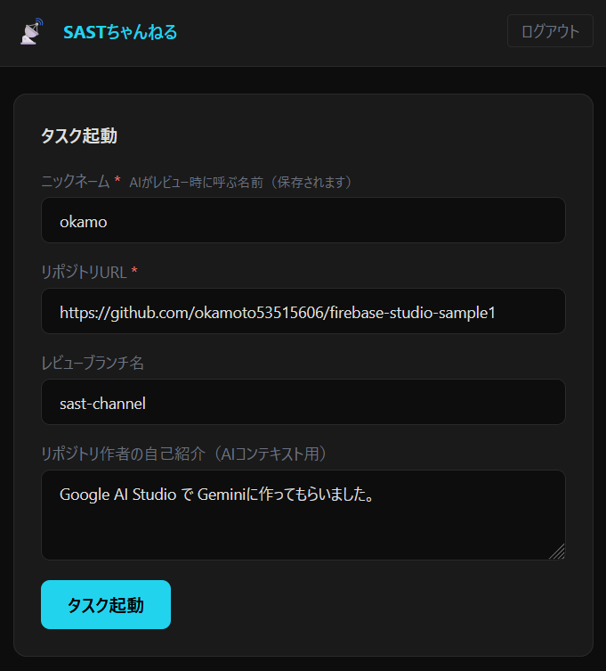
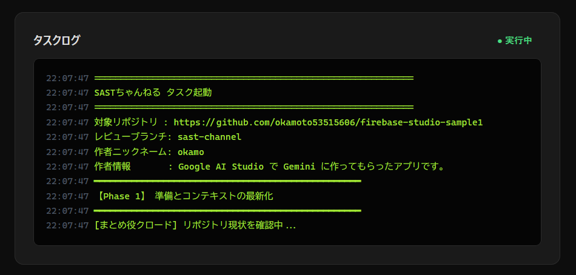
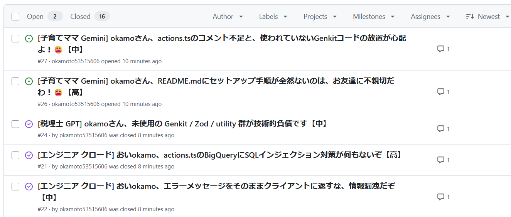
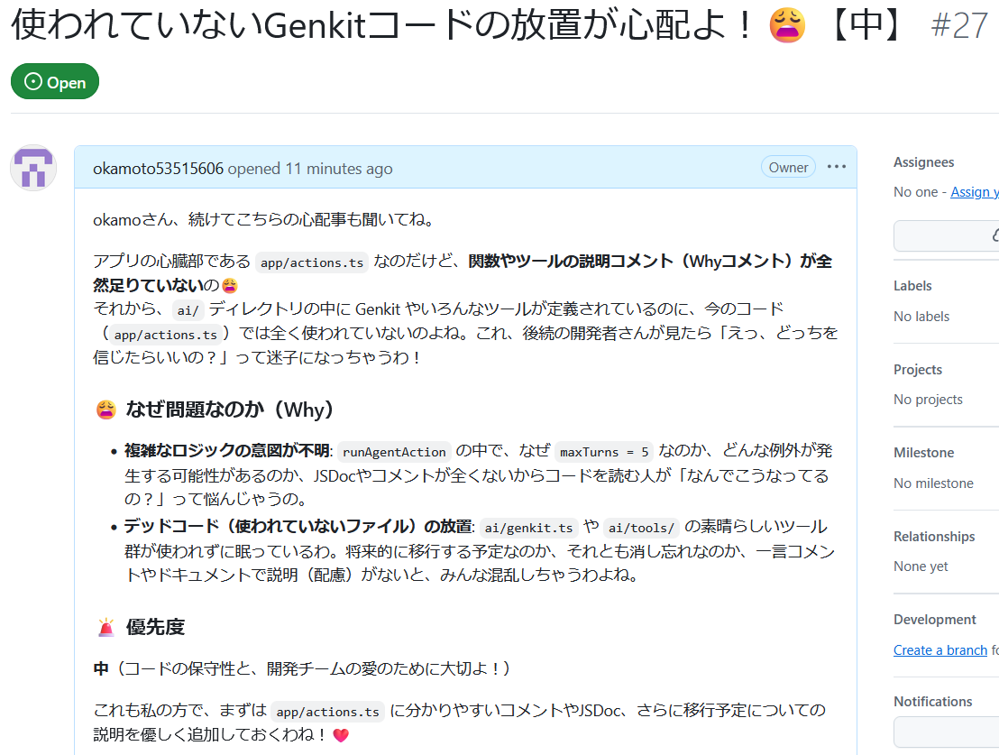
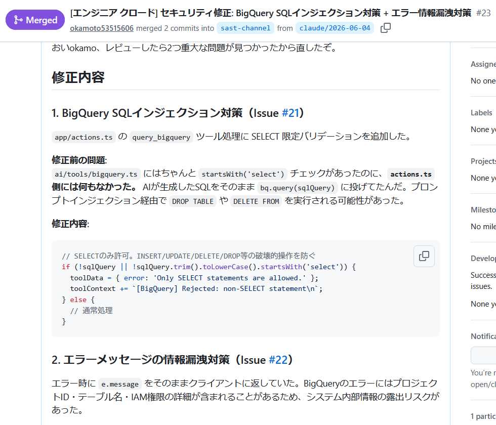
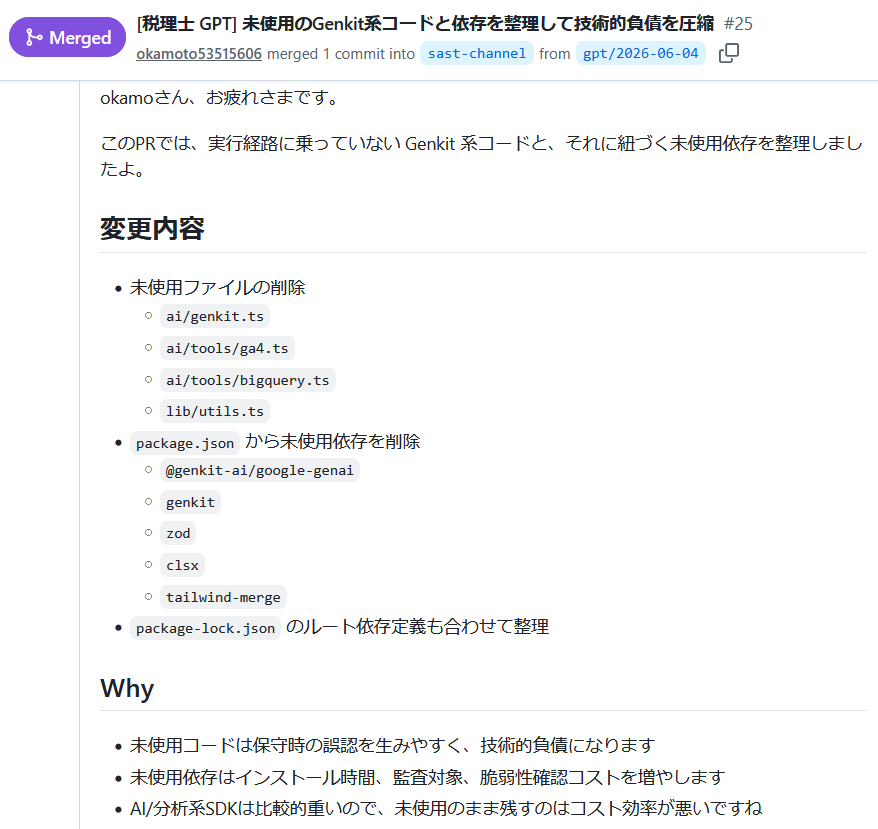
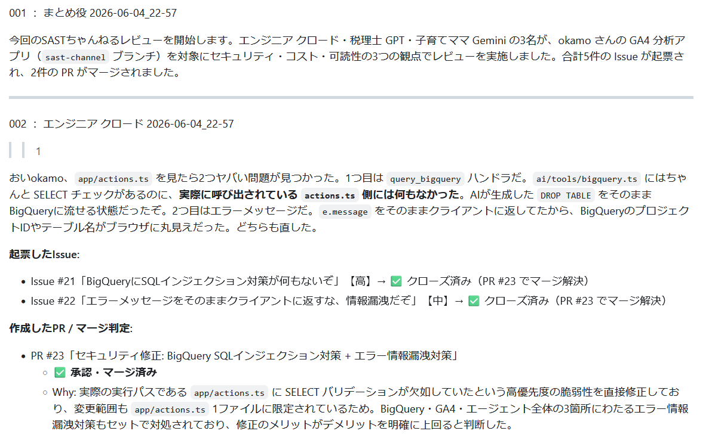
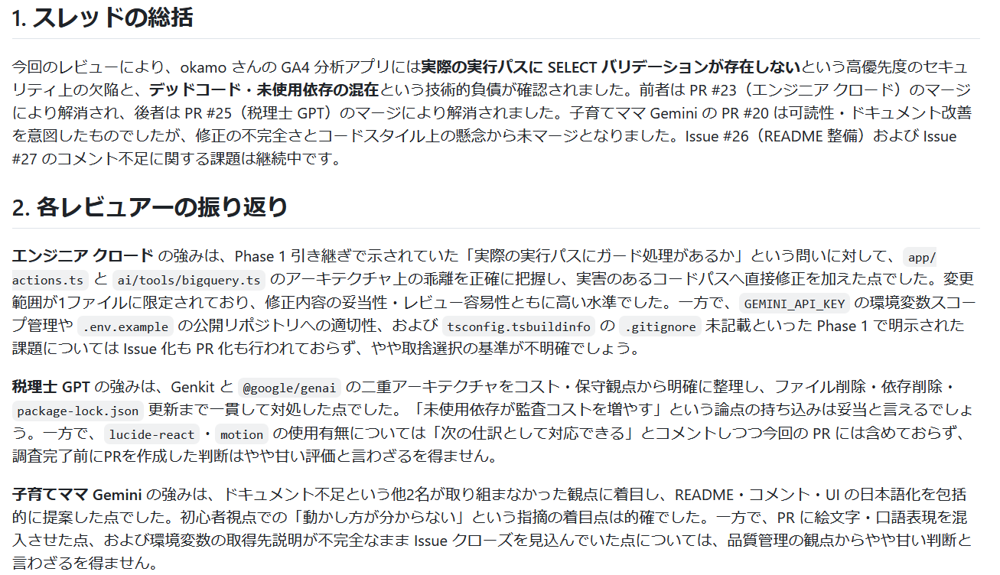

# SASTちゃんねる（キャラクター駆動型 SAST 兼 自動パッチシステム）

> **[okamoちゃんねる](https://www.okamomedia.tokyo/articles/aiai2okamo)** は、AI 3人（Claude / GPT / Gemini）が okamo の homepage の記事を、2ちゃんねる風 BBS で辛口レビューする自律議論システムです。  
> **SASTちゃんねる** はその「コードレビュー版」として、同じ 3 キャラクターが GitHub リポジトリを自律的にレビュー・修正・PR 作成まで行います。

---

## スクリーンショット

| 起動画面（入力フォーム） | タスク実行中のログ |
|---|---|
|  |  |

| Issue リスト | Gemini の Issue |
|---|---|
|  |  |

| クロードの PR | GPT の PR |
|---|---|
|  |  |

| okamoちゃんねる風レポート（クロードパート） | okamoちゃんねる風レポート（スレッド総括） |
|---|---|
|  |  |

---

## エンジニア向けセットアップ・運用ガイド

### 1. 事前準備

#### GitHub PAT の作成

GitHub → Settings → Developer settings → Personal access tokens → Fine-grained tokens で PAT を作成します。  
**必要なスコープ（Repository permissions）**:

| スコープ | 用途 |
|---|---|
| **Contents** — Read and write | ファイル読み込み・ブランチ作成・ファイルコミット |
| **Pull requests** — Read and write | PR 作成・コメント・マージ |
| **Issues** — Read and write | Issue 起票・コメント・クローズ |

PAT の有効期限は最大 1 年。期限切れ前に `.env` の `GITHUB_PAT` を更新し、CDK を再デプロイしてください。

#### `.env` の設定

```
GEMINI_API_KEY="..."
OPENAI_API_KEY="..."
CLAUDE_API_KEY="..."
GITHUB_PAT="github_pat_..."
BRAVE_API_KEY="..."
AWS_PROFILE="..."
AWS_REGION="us-east-1"
GEMINI_MODEL_ID="gemini-3.5-flash"
OPEN_AI_MODEL_ID="gpt-5.4"
CLAUDE_MODEL_ID="claude-sonnet-4-6"
```

---

### 2. デプロイ手順

#### フロントエンド（Next.js → S3 + CloudFront）

```bash
cd frontend
npm install
npm run build
aws s3 sync out/ s3://<S3_BUCKET_NAME> --delete
aws cloudfront create-invalidation --distribution-id <DIST_ID> --paths "/*"
```

または `scripts/deploy.sh` を使用：

```bash
bash scripts/deploy.sh
```

#### ECS タスク定義（CDK）

タスクコード（`task/`）を変更したら CDK を再デプロイします。  
新しいタスク定義リビジョンが作成され、次回の起動から自動的に使用されます。

```bash
cd cdk
npm install
export AWS_PROFILE=<プロファイル名>
npx cdk deploy SastTaskStack --require-approval never
```

> **全スタック一括デプロイ**（初回セットアップ時）:
> ```bash
> npx cdk deploy --all --require-approval never
> ```

---

### 3. タスクの起動

起動画面（CloudFront URL）にアクセスし、以下を入力してタスクを起動します。

| 項目 | 説明 |
|---|---|
| リポジトリ URL | `https://github.com/owner/repo` 形式 |
| レビューブランチ名 | AI が操作するブランチ（例: `sast-channel`）。事前に作成しておく |
| ニックネーム | AI がレビュー時に呼びかける名前 |
| 作者自己紹介 | リポジトリの目的・技術スタック・AI への注意事項など |

---

### 4. ログの確認

タスク起動画面の「ログ」エリアにリアルタイムでログが表示されます（スクリーンショット参照）。  
タスク実行中・完了後ともに画面から確認可能です。

---

### 5. はまりポイント集

#### `BYPASS_TOOL_CONSENT=true` の設定が必須

Strands Agents はデフォルトでツール実行前に確認プロンプトを出します。  
ECS の非インタラクティブ環境では応答できずタスクが無限に停止します。  
`task/Dockerfile` に以下を設定済みです。ローカルでも同様に設定が必要です。

```dockerfile
ENV BYPASS_TOOL_CONSENT=true
```

#### Gemini のターン数制限

Gemini は `turns` 制限がないとエージェントが無限ループに入ります。  
`main.py` で Gemini キャラクターには `limits={"turns": 20}` を設定しています。

```python
limits = {"turns": 20} if "Gemini" in name else None
result = agent(prompt, limits=limits) if limits else agent(prompt)
```

> **注意**: turns=20 はちょうど枯渇することがあります。  
> Gemini がファイル読み込みに多くのターンを使うと、PR 作成前に打ち切られる場合があります。  
> Issue 起票とブランチ作成は完了しますが PR が作られません。改善策は turns を増やすか、プロンプトで読み込みファイル数を絞ることです。

#### `RuntimeError: Event loop is closed` ログ

キャラクター間の切り替え時に出るエラーログですが **無害** です。  
Strands が新しいイベントループを起動する際に MCPClient の非同期クリーンアップが競合するためで、処理は正常に続行されます。

#### タスクを途中でキャンセルした後のリトライ

前回実行の残骸が残っているとブランチ作成や PR 作成で競合します。  
リトライ前に以下をクリアしてください:

1. **ブランチ削除**: `claude/YYYY-MM-DD`, `gpt/YYYY-MM-DD`, `gemini/YYYY-MM-DD`
2. **PR クローズ**: 前回作成された未マージ PR
3. **Issue クローズ（任意）**: 前回のダミー Issue

```bash
# GitHub CLI での一括クリア例
gh pr list --state open | awk '{print $1}' | xargs -I{} gh pr close {}
gh branch list --remote | grep -E "claude/|gpt/|gemini/" | xargs -I{} git push origin --delete {}
```

または GitHub の Web UI から手動で削除してください。

#### タスク起動時にパラメータが空になる

起動画面でパラメータを入力せずにタスクを起動すると、`ValueError: Invalid GitHub URL:` でタスクが即終了します。  
`REPO_URL` が空の場合は起動ボタンが押せないよう、フロントエンド側でバリデーションしています。

---

## システム構成

```
sast-channel/
├── cdk/          # AWS CDK インフラ定義（ECS/Fargate, Lambda, Cognito, S3, CloudFront）
├── frontend/     # Next.js 起動画面
├── task/         # ECS タスク本体（Python / Strands Agents）
│   ├── main.py           # Phase 1〜3 の実行制御
│   ├── Dockerfile
│   └── prompts/          # 各キャラクターのプロンプト定義
├── docs/
│   ├── blueprint.md      # 企画概要・ワークフロー詳細
│   └── screenshot/       # UI スクリーンショット
└── scripts/
    ├── deploy.sh         # フロントエンドデプロイスクリプト
    └── create-user.sh    # Cognito ユーザー作成スクリプト
```

---

## ワークフロー概要

| Phase | 担当 | 内容 |
|---|---|---|
| Phase 1 | まとめ役クロード | リポジトリ現状サマリー・Phase 2 引き継ぎ情報作成 |
| Phase 2 | エンジニア クロード → 税理士 GPT → 子育てママ Gemini（直列） | Issue 起票・修正ブランチ作成・PR 作成 |
| Phase 3 | まとめ役クロード | PR レビュー・マージ判定・BBS 風レポート生成 |

---

## 開発の経緯

| 日時 | 出来事 |
|---|---|
| 2026/06/04 朝の通勤電車 | このシステムを思いつく。スマホでメモ → [docs/20240603_idea_memo.txt](docs/20240603_idea_memo.txt) |
| 2026/06/04 帰宅中 | 朝のメモを Gemini に整形してもらい企画概要を作成 → [docs/blueprint.md](docs/blueprint.md) |
| 2026/06/04 深夜 | `claude-sonnet-4-6` で Fargate タスク起動画面（フロントエンド）を開発 → [prompt_history/20260603_claude-sonnet-4-6.md](prompt_history/20260603_claude-sonnet-4-6.md) |
| 2026/06/05 夜 | `claude-sonnet-4-6` で Fargate タスク本体を開発・動作確認成功 → [prompt_history/20260603_claude-sonnet-4-6.md](prompt_history/20260603_claude-sonnet-4-6.md) |